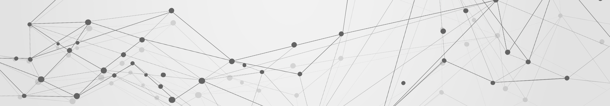

<!--- LANGUAGE --->
<h6 align="center"> <a href="/README.md">PORTUGUÊS</a> • <a href="/README_en.md">ENGLISH</a>
</h6>

<!--- BANNER --->

<!--- BIO --->
 

Data Analyst with a background in business consulting, currently pursuing a degree in Systems Analysis and Development. I'm looking to combine my technical skills in programming and data analysis with my ability to diagnose and solve business problems. My goal is to implement data-driven solutions that identify opportunities for improvement and create tangible impact on business results

<!-- BLOG POSTS -->
<!--
<h3 align="center"><b>📄 LATESTS BLOG POSTS</b></h3>

___

-->

<!-- PROJECTS -->
<!--
<h3 align="center"><b>🗂️ FEATURED PROJECTS</b></h3>

---

-->

<!-- CURRENTLY LEARNING -->
### Tools and Skills

    
    
    
    
    

    
    
    
    

    
    
    
    
    

<!-- CONTACT -->

### Get In Touch

 

  
  
  
   
  <!--
  
  --> 

 

 
<!-- FOOTER -->

